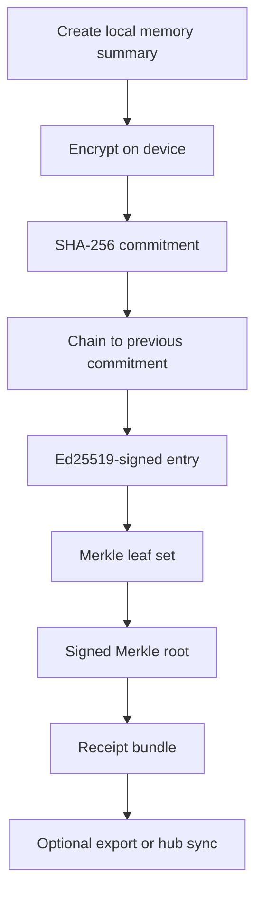
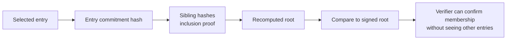

# Architecture — Verifiable Memory Palace & Sovereign Hub Mode 2.0

This note explains the Phase 3 architecture in plain language first, then in system terms.

---

## Plain-language summary

The Verifiable Memory Palace is a **private, tamper-evident ledger** for long-term AI-assisted context.

Each entry is:

1. encrypted locally,
2. committed with SHA-256,
3. chained to the previous committed entry,
4. signed with Ed25519,
5. folded into a Merkle root,
6. exportable as a signed receipt with an inclusion proof.

The result is simple:

- the user keeps the underlying facts,
- the integrity of the record becomes independently checkable,
- and one selected record can be proven without exposing the entire private timeline.

---

## Ledger components

| Component | Purpose |
| --- | --- |
| `memoryEntries` | Encrypted local records with signed payloads and SHA-256 commitments |
| `memoryRoots` | Signed Merkle-root snapshots over committed entries |
| `memoryReceipts` | Exportable proof bundles tying one entry to a signed root |
| `hubSyncQueue` | Local queue for delayed commitment sync when the link is weak |
| `hubAudit` | Local audit trail of pairing and sync actions |

---

## Commitment flow

---

## Selective disclosure flow

---

## Sovereign Hub Mode 2.0 boundary

Sovereign Hub Mode 2.0 is intentionally narrow.

It is designed to sync:

- memory roots,
- claim commitments,
- trigger heads,
- signed receipts or audit metadata when the user chooses.

It is **not** intended to become a default cloud memory backend. The user keeps sovereignty by combining:

- manual pairing,
- pinned hub public keys,
- encrypted sync envelopes,
- local queueing for intermittent links,
- commitment-first rather than raw-content-first sync.

---

## Burgess alignment

The ledger improves **integrity**, **auditability**, and **selective disclosure**.

It does **not** change the Burgess Principle itself:

- a real human still has to review the facts,
- AI remains advisory,
- cryptography proves record integrity, not legal truth,
- exported receipts support human accountability rather than replacing it.
