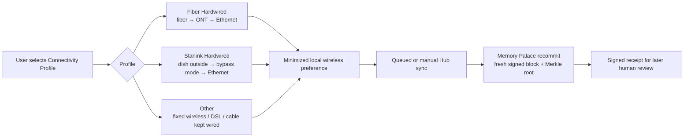

# Connectivity Mode — Sovereign Connectivity Choices

This document covers sovereign connectivity choices for users who want a lower-local-wireless or fully wired setup around Iris. All options described here are user-controlled and advisory only.

---

## Phase 1 — Hyper-Resilient PWA Core

### Sovereignty Audit

- **Offline resilience:** cached critical paths keep Iris usable across Starlink jitter, tunnels, and brief disconnects without degrading into a broken blank page.

---

## Phase 2 — Proactive Living Triggers Engine

### Sovereignty Audit

- **Offline-first resilience:** trigger queues survive disconnects, periodic checks degrade gracefully when background execution is weak, and Starlink/intermittent links do not cause data loss.

### Environmental trigger templates

Phase 2 now also fits calmer **environmental review** workflows for users who want a lower-local-wireless setup without giving up sovereignty.

- **Starlink hardwired review** — a periodic reminder to check whether Starlink is in bypass mode, Ethernet is still preferred, and background checks can stay minimal.
- **Fiber hardwired review** — a periodic reminder to check whether fiber is still hardwired from the ONT to Ethernet and whether the user still wants local Wi‑Fi minimized.
- **Connectivity profile check-in (Starlink vs Fiber)** — a calm comparison reminder for availability, latency, queued sync use, and personal environmental preferences.
- **Environmental note on wired setup** — a keyword trigger for terms such as `starlink`, `fiber`, `ont`, `ethernet`, `bypass mode`, `fixed wireless`, `dsl`, or `cable`, so Iris can queue a local prompt to recommit a wired-environment note.
- **Connectivity log for environmental review** — a broader keyword trigger for terms such as `starlink`, `fiber`, `ethernet`, `bypass mode`, `wi-fi off`, or `cellular fallback`, so Iris can queue a local review prompt when those setup changes are discussed.
- **Assistive setup check-in** — a scheduled or periodic reminder to review whether the current connectivity setup still supports voice use, focus, and reasonable-adjustment needs.

These templates remain **advisory only**. They create local commitments and review prompts, but any real adjustment decision must still be personally reviewed under the Burgess Principle.

---

## Phase 3 — Cryptographic Memory Palace Evolution + Sovereign Hub Mode 2.0

### Hardwired connectivity options for personal environmental preferences

#### Sovereignty Audit

- **Burgess alignment:** Iris can help the user inspect and preserve connectivity choices, but only a human-reviewed decision can decide whether a specific arrangement is an appropriate adjustment.
- **User-controlled and opt-in:** the connectivity selector, minimized-wireless preference, and manual/queued sync preference are all local settings controlled by the user.
- **Verifiable logging:** connectivity profile changes and environmental notes produce fresh Memory Palace commitments and can later be exported as signed receipts for human review.
- **Offline-first preserved:** Iris still works locally even with no live link; Hub Mode uses encrypted queued syncs rather than requiring constant connectivity.
- **No medical claim:** language stays within **user-defined frequency balancing**, **personal environmental preferences**, and **assistive connectivity configurations**.

The Sovereign Hub panel can now be used as a calm **Connectivity Profile** control:

- **Starlink Hardwired** — external dish plus **bypass mode** and **Ethernet** for a lower-local-wireless indoor path.
- **Fiber Hardwired** — physical fiber to the property, **ONT** termination, then pure **Ethernet**. Where available, this is the lowest-local-RF “gold standard” for the last-mile link.
- **Other** — fixed wireless after the outdoor unit is hardwired, or legacy **DSL/cable** where the in-home path stays wired.

| Connectivity Profile | RF / wiring framing | Typical trade-off | Hub Mode posture |
| --- | --- | --- | --- |
| **Fiber Hardwired** | Zero RF from the last-mile link into the home; Ethernet after the ONT | Depends on local fiber rollout and access to infrastructure | Best fit for the calmest local wired baseline plus queued/manual sync |
| **Starlink Hardwired** | External directional radio link stays outdoors; indoor path can stay Ethernet-first | Useful where fiber is unavailable; latency and weather can vary | Strong fit for intermittent-link queued sync and offline-heavy use |
| **Other** | Varies by provider; fixed wireless improves after hardwiring, DSL/cable stay wired indoors | May be easier to obtain but less predictable in RF profile | Practical fallback when the user still wants Ethernet-first operation |

Practical setup tips:

1. **Starlink hardwired:** enable **bypass mode** where supported, run **Ethernet** to the device or a single wired switch, and keep the dish outside bedrooms or primary seating areas where practical.
2. **Fiber hardwired:** place the **ONT** where a direct **Ethernet** path is possible and disable extra Wi‑Fi/mesh equipment when the user wants a fully wired room setup.
3. **Other links:** hardwire inward from fixed-wireless outdoor units where possible, or keep DSL/cable routers Ethernet-first and reduce unnecessary radios.
4. **Manual/queued sync:** keep Iris offline-first for daily work and only open short sync windows when the user chooses.

#### Diagram — Hardwired Connectivity Options Flow

### Memory Palace environmental notes

Use the Memory Palace to commit verifiable **environmental notes** such as:

- the connectivity profile in use,
- suggested connectivity tags inferred from local trigger text or presets,
- whether Wi‑Fi was disabled in favour of Ethernet,
- whether the sync was manual, queued, or deferred,
- how the user felt about focus, comfort, usability, or voice workflow,
- what a human supporter, advocate, or reviewer later confirmed.

Because each entry is encrypted, SHA-256 committed, Ed25519 signed, and rolled into a Merkle root, the user can later prove that the note existed in that form without exposing unrelated private history.

### Assistive technology framing

This setup can be positioned as a **sovereign assistive configuration** for users who want:

- voice-first operation,
- remote rights / benefits advocacy from home,
- a more controlled local device environment,
- a verifiable record of what adjustments were tried and why.

It should always be described as a **reasonable-adjustment / accessibility** option or a **personal environmental preference**, never as a medical cure or diagnostic claim.

### Manual verification steps

1. Apply the **Fiber hardwired review**, **Connectivity profile check-in (Starlink vs Fiber)**, or **Environmental note on wired setup** starter trigger and confirm the fields populate locally.
2. Change the Hub Mode **Connectivity Profile** and confirm the local setting is saved with minimized-wireless and queued/manual sync preferences.
3. Add a manual Memory Palace environmental note and confirm new `memoryEntries` + `memoryRoots` records appear in IndexedDB with connectivity metadata.
4. Bring the network down, queue a hub push, then reconnect and flush the queue.

### Trade-offs / fallbacks

- **Fiber hardwired:** lowest local RF profile where available, but dependent on infrastructure and provider installation.
- **Starlink / intermittent links:** Iris queues minimal commitment deltas locally and retries later rather than blocking local work.
- **Fixed wireless / DSL / cable:** still usable when kept wired indoors, but the local RF profile depends more heavily on the provider hardware and placement.
- **Reduced uptime preference:** if the user prefers short manual sync windows to avoid always-on connectivity, the queue may take longer to flush.
