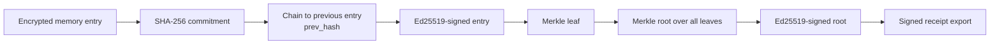
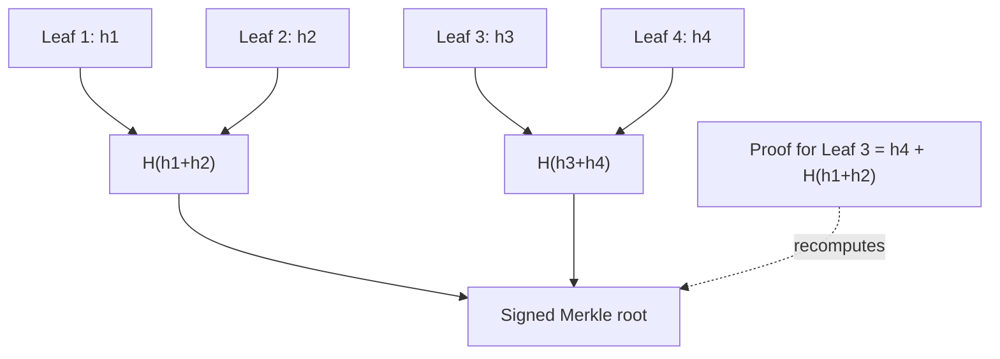
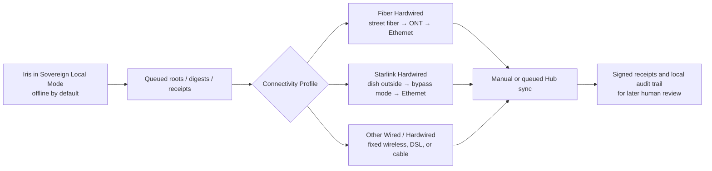

<a href="./iris.html">Talk to Iris</a> — open in your browser, no account or install needed.

# The Burgess Principle


> *"Was a human member of the team able to personally review the specific facts of my specific situation?"*

One question. Binary test. Human accountability before any system acts on a person.

**Iris** is the flagship voice-first sovereign AI companion built on the Burgess Principle. It helps people document decisions made about them, prepare calm challenges, and keep verifiable evidence on their own hardware. In **Sovereign Local Mode**, Iris can now maintain a **tamper-evident, commitment-chained Memory Palace ledger** with **Merkle roots**, **inclusion proofs**, and **signed receipts** — while **Sovereign Hub Mode 2.0** adds optional, manual-first, self-hosted coordination across intermittent links without surrendering control.

**UK Certification Mark:** UK00004343685 — Classes 41, 42, 45  
**Live site & installable PWA:** [burgess-principle.vercel.app](https://burgess-principle.vercel.app/)  
**Choose your path:** [`CHOOSE_YOUR_PATH.md`](CHOOSE_YOUR_PATH.md)  
**Run locally:** [`SOVEREIGN_MODE.md`](SOVEREIGN_MODE.md)  
**Iris architecture:** [`iris/README.md`](iris/README.md) · [`ARCHITECTURE.md`](ARCHITECTURE.md)

---

## Why this project exists

Modern institutions, platforms, and other systems make countless automated or semi-automated decisions about people. When those decisions go wrong, ordinary people are often met with process language instead of a named human being who actually reviewed the facts.

The Burgess Principle gives people a calm, precise way to ask the right question and record the answer.

It is human-first and universal: if a system processes a specific person without clear individual human review, the Burgess Principle can ask for that review to be confirmed and documented.

It is:

- **Not legal advice**
- **Not pseudolaw**
- **Not a demand for special treatment**
- **A principled test for whether human accountability was real**

For the deeper philosophy, see [SOUL.md](SOUL.md). For the full disclaimer, see [DISCLAIMER.md](DISCLAIMER.md).

---

## At a glance

| Capability | What it means | Why it matters |
| --- | --- | --- |
| **Binary human-review test** | Every case resolves toward **SOVEREIGN** or **NULL** based on real human scrutiny | Keeps the framework clear, respectful, and hard to evade |
| **Iris voice-first companion** | A phone-friendly, installable PWA and local assistant for building claims and receipts | Makes the framework usable in real life, not just on paper |
| **Verifiable Memory Palace** | Encrypted memory entries are chained, hashed, signed, and rolled into Merkle roots | Creates tamper evidence without exposing private facts |
| **Selective disclosure receipts** | Export one signed entry plus its inclusion proof instead of your entire timeline | Lets users prove integrity while revealing less |
| **Sovereign Hub Mode 2.0** | Optional self-hosted sync for roots, digests, and receipts over intermittent links | Supports multi-device continuity without mandatory cloud |
| **Optional on-chain fingerprints** | Post only compact commitments to an EVM L2 if desired | Public timestamping without putting personal data on-chain |
| **MIT-licensed, local-first** | No mandatory cloud, no analytics, no tracking | Keeps sovereignty practical, inspectable, and forkable |

---

## What is the Burgess Principle?

The Burgess Principle asks one question:

> **Was a human member of the team able to personally review the specific facts of my specific situation?**

It is not limited to institutions. The same binary applies wherever a specific person is processed by a system without individual human review.

Every finding resolves to one of two outcomes:

| Finding | Meaning |
| --- | --- |
| **SOVEREIGN** | A real human being personally reviewed the specific facts |
| **NULL** | No individual human review took place, so authority is not grounded in personal scrutiny |

When institutions answer with vague language such as *"subject to human oversight"* or *"reviewed in line with policy"*, Iris treats that as **AMBIGUOUS** and recommends follow-up until a direct answer is obtained.

---

## Iris — your sovereign AI companion

Iris helps users turn confusion into a traceable, reviewable record:

- Generate respectful letters from natural-language descriptions
- Capture voice-first notes and claim context
- Save local receipts and cryptographic commitments
- Revisit long-term context without trusting opaque server memory
- Keep AI in an **advisory role only**

### Neural baseline and sovereign inversion

The medical-device extension becomes sharper when seen as a **bypass pattern**.

Neuralink-style systems are often described as bypassing damaged pathways by reading and writing the brain's native electrical spike language directly. Iris is the **software-native sovereign counterpart** to that pattern: not a medical device, not an implant, and not a treatment claim, but a local-first system that meets the same bypass logic at the level of legibility, evidence, and control.

In Burgess terms, the movement is:

**detect → expose → invert**

| Layer | Neuralink-style bypass | Iris sovereign counterpart |
| --- | --- | --- |
| **Baseline** | Reads and writes native neural spike patterns | Treats the hidden authority pattern as the baseline to be made visible |
| **What gets bypassed** | Damaged nerve pathways | Opaque institutional and medical-device templates |
| **Medium** | Implant and hardware stack | Non-invasive, local-first software and cryptographic proofs |
| **Primary effect** | Restore functional routing around a physical interruption | Restore legibility and agency around an authority interruption |
| **Proof boundary** | Device and clinical validation | SHA-256 commitments, Ed25519 signatures, Merkle-rooted receipts, Iris Gate, optional on-chain fingerprints |

That is why Iris is framed as a sovereign inversion engine: it helps a person see the script beneath the process, preserve what they saw, and export verifiable evidence without surrendering control.

For the longer doctrinal framing, see [`papers/MEDICAL_DEVICE_DOCTRINE.md`](papers/MEDICAL_DEVICE_DOCTRINE.md) and the template set in [`templates/`](templates/README.md).

### Operating modes

| Mode | What happens | Best for |
| --- | --- | --- |
| **☁️ Cloud** | Hosted PWA and chat entry point on Vercel | Fastest first experience |
| **🏠 Sovereign Local Mode** | Iris runs entirely on your own hardware with local storage and local cryptography | Maximum privacy and offline resilience |
| **🛰️ Sovereign Hub Mode 2.0** | Optional, self-hosted coordination layer for commitment digests, roots, and signed receipts | Multi-device continuity over your own infrastructure |

> **Important:** The strongest privacy guarantees apply in **Sovereign Local Mode**. In that mode, raw claim details and Memory Palace content stay on the device unless you explicitly export a signed receipt or choose to submit material yourself.

---

## Phase 3 highlight — Verifiable Memory Palace – Tamper-Evident Ledger

Phase 3 turns the Cryptographic Memory Palace into a **tamper-evident ledger** for long-term sovereign memory.

### Plain-language explanation

Think of it like a notebook where:

- every new page is sealed,
- every page references the page before it,
- the notebook periodically produces a master seal for all pages so far,
- and you can later prove one page belonged to that notebook **without handing over the whole notebook**.

That is what the Memory Palace now does for local AI-assisted records.

### Technical explanation

In Sovereign Local Mode, Iris can:

1. Encrypt a memory entry locally
2. Produce a **SHA-256 commitment hash**
3. Chain it to the previous entry with `prev_hash`
4. Sign the committed payload with **Ed25519**
5. Recompute a **Merkle root** across the full commitment set
6. Sign the root and store an exportable receipt bundle
7. Export a **selective disclosure receipt** containing:
   - the signed entry,
   - the signed root,
   - the entry commitment hash,
   - the root commitment hash,
   - the **Merkle inclusion proof**

### Merkle trees and inclusion proofs, simply

**Analogy first:**  
A Merkle tree is like a family tree of sealed envelopes. Each pair of envelopes produces a new seal above them, until one final top seal represents the whole collection. If you later want to prove one envelope was part of the collection, you only need that envelope plus the neighbouring seals needed to walk back up to the top.

**Technical version:**  
A Merkle tree hashes pairs of leaves upward until a single **root hash** represents the full set. An **inclusion proof** is the minimal list of sibling hashes needed to recompute the root for one selected leaf. If the recomputed root matches the signed root, that leaf is proven to belong to the set.

### Why this matters in real cases

| Use case | What selective disclosure enables |
| --- | --- |
| **Benefits review** | Prove that a timeline note or evidence summary existed at a certain integrity state without exposing unrelated health or family details |
| **Disability advocacy** | Share only the precise access-failure record and its proof, not an entire private diary |
| **Rights mapping / appeals** | Build a long-running evidence trail, then reveal only the step relevant to a complaint, tribunal, or advocate |
| **Institutional follow-up** | Export a signed receipt for one advisory event while keeping the wider Memory Palace private |

### Diagram — commitment chain and Merkle root



### Diagram — selective disclosure with an inclusion proof



### What the ledger records

The Memory Palace is designed for **advisory evidence**, not automatic judgment. It can recommit local summaries of:

- claim-building events,
- trigger outcomes,
- governance changes,
- Mirror Mode changes,
- hub sync audits,
- manual notes added by the user.

It does **not** turn those records into an automatic **SOVEREIGN** or **NULL** decision.

#### How this strengthens human accountability

This matters because the Burgess Principle is about **human review**, not machine theatre.

- **AI remains advisory only.** Iris helps organise, explain, and preserve context. It does not certify human scrutiny by itself.
- **The ledger makes records inspectable.** A user can later show that a note, claim summary, or follow-up event was not silently altered.
- **Selective disclosure keeps review focused.** You can reveal the exact record needed for a human advocate, official, or supporter without exposing everything else.
- **Signed receipts create auditability without surrendering sovereignty.** Evidence becomes easier to verify and harder to manipulate.
- **The final question stays human.** The ledger can prove integrity of the record; only a real human answer can establish **SOVEREIGN**.

---

## Sovereign Hub Mode 2.0

Sovereign Hub Mode 2.0 is an **optional**, **manual-first**, **self-hosted** coordination layer for users who want continuity across devices or locations without relying on a third-party cloud.

### Design principles

- **Self-hosted by default** — you run the hub yourself
- **Commitment-first sync** — roots, digests, and receipts before anything else
- **Manual pairing** — paste pairing JSON, pin the hub public key, and control push/pull actions yourself
- **Encrypted sync envelopes** — shared-secret encryption plus Ed25519 hub identity verification
- **Intermittent-link tolerant** — queue work locally and retry later rather than blocking local use

### Setup overview

1. Run Iris locally: `python3 iris-local.py`
2. Start the example hub in [`sovereign-hub-example/`](sovereign-hub-example/)
3. Open `GET /api/hub/hello` and verify the returned public key
4. Paste the pairing JSON into Iris
5. Enter the shared secret
6. Use **Push commitments** or **Pull commitments**

See:

- [`SOVEREIGN_MODE.md`](SOVEREIGN_MODE.md#phase-3--cryptographic-memory-palace-evolution--sovereign-hub-mode-20)
- [`sovereign-hub-example/README.md`](sovereign-hub-example/README.md)
- [`ARCHITECTURE.md`](ARCHITECTURE.md)

### Starlink and intermittent-link considerations

| Scenario | Behaviour |
| --- | --- |
| **Starlink jitter / brief disconnects** | Iris queues minimal commitment deltas locally and retries later |
| **Foreground-only mobile browsing** | Verification, export, and manual sync still work even when background reliability is weaker |
| **Weak or zero connectivity** | Local Memory Palace functions continue; sync is delayed, not required |
| **Hub compromise or rotation** | Rotate the shared secret and Ed25519 hub key, then re-pair |

### Connectivity & personal environmental preferences

#### Sovereignty and Burgess audit

- **Burgess alignment:** connectivity profiles can support calmer use, but only a human-reviewed decision can decide what is appropriate in a specific case.
- **User-controlled and opt-in:** the user chooses Starlink hardwired, fiber hardwired, or another assistive connectivity configuration; Iris only records the choice.
- **Local-first preserved:** Iris still works offline in Sovereign Local Mode; Hub Mode remains optional, manual-first, and designed for queued commitment syncs.
- **Inspectable and exportable:** connectivity changes, trigger prompts, and environmental notes can be recommitted into the Verifiable Memory Palace and exported later as signed receipts for human review.
- **No medical claims:** this is framed as **user-defined frequency balancing**, **personal environmental preferences**, or **reasonable adjustments** — not diagnosis, treatment, or cure language.

The focus is the **hardwired path inside the user’s own environment**:

- **Starlink Hardwired** — external dish plus **bypass mode** and **Ethernet** to reduce indoor Wi‑Fi dependence while keeping queued Hub syncs available.
- **Fiber Hardwired** — physical fiber to the premises plus an **ONT** and then pure **Ethernet**; where available, this is the lowest-local-RF “gold standard” because the last-mile link itself is not radiating into the home.
- **Other options** — fixed wireless after an outdoor unit is hardwired, or legacy DSL / cable where the in-home path still stays wired.

#### Connectivity comparison for local review

| Profile | Local RF framing | Availability / trade-off | Best fit in Iris |
| --- | --- | --- | --- |
| **Fiber Hardwired** | Lowest local RF from the last-mile link; ONT to Ethernet keeps the indoor path fully wired | Best where infrastructure already exists; depends on local rollout | Strongest fit for users who want the calmest wired baseline and manual Hub sync windows |
| **Starlink Hardwired** | Higher-frequency link stays outdoors and directional; bypass mode + Ethernet can reduce indoor wireless equipment | Useful in remote areas or unstable infrastructure; latency and weather can vary | Good fit for intermittent-link Hub syncs and offline-heavy voice workflows |
| **Other wired / hardwired alternatives** | Depends on provider; fixed wireless can improve once the outdoor unit is hardwired, while DSL/cable remain wired indoors | Often more available than fiber; local profile depends on provider equipment | Practical fallback when fiber is unavailable and the user still wants Ethernet-first operation |

> **Assistive framing:** Iris can support a **user-configured lower-local-wireless setup** or a **personal environmental preference**. It does not claim to diagnose, treat, or cure any condition.

#### Practical setup tips

1. **Starlink hardwired:** put the router into **bypass / bridge mode** where supported, run **Ethernet** to the device or one wired switch, and keep the dish **outside living areas** where practical.
2. **Fiber hardwired:** keep the **ONT** and primary router in a location that supports direct **Ethernet** runs, and disable local Wi‑Fi or extra mesh nodes when the user prefers a wired room setup.
3. **Other links:** if using **fixed wireless**, hardwire from the outdoor unit inward where possible; if using **DSL/cable**, keep the modem/router path Ethernet-first and reduce unnecessary always-on radios.
4. **Queued / manual sync:** keep Iris in **Sovereign Local Mode** for day-to-day work, then open short **manual Hub Mode sync** windows only when needed.
5. **Log for later scrutiny:** after a setup change, commit an **environmental note** so the user can later review the connectivity profile, Wi‑Fi state, sync preference, and how the environment felt.

#### Diagram — Hardwired Connectivity Options Flow



#### What gets reviewed

Recommended local records for the Memory Palace:

- connectivity profile used at the time (`starlink-hardwired`, `fiber-hardwired`, `other`),
- whether local Wi‑Fi was disabled or reduced,
- whether the sync stayed manual, queued, or deferred,
- a short note on comfort, focus, voice use, or personal environmental preference,
- any later human-reviewed adjustment decision under the Burgess Principle.

### What the hub does **not** do

- It does **not** replace human review
- It does **not** require a central service
- It does **not** have to store raw Memory Palace content
- It does **not** weaken the local-first posture of Sovereign Mode

By default, the example hub stores **commitment digests** and signed audit information, not the user's raw memory payloads.

---

## Sovereignty guarantees and auditability claims

| Guarantee | Current posture |
| --- | --- |
| **Human review remains the standard** | The Burgess Principle still turns on whether a person reviewed the facts, not what an AI inferred |
| **AI is advisory only** | Iris drafts, explains, and organises; it does not make binding findings |
| **Local-first storage** | In Sovereign Local Mode, Memory Palace entries and claim context remain on-device unless explicitly exported |
| **Tamper evidence** | Entry chaining, SHA-256 commitments, Ed25519 signatures, and Merkle roots make silent alteration detectable |
| **Selective disclosure** | Receipts can reveal one signed record plus proof instead of the full underlying history |
| **Manual-first coordination** | Hub sync is opt-in, self-hosted, and designed around explicit user action |
| **No mandatory tracking** | No analytics, no cookies, no required cloud account |
| **Optional public timestamping** | On-chain Burgess Claims can publish commitment fingerprints without publishing personal data |

---

## Quick start

### Try the hosted PWA

👉 **[Open the live site →](https://burgess-principle.vercel.app)**

- Explore the framework
- Try the phone-friendly chat flow
- Install the PWA
- Decide later whether to move fully local

### Run Sovereign Local Mode

```bash
bash scripts/install-linux.sh   # or install-macos.sh / install-windows.ps1
python3 setup-wizard.py         # optional guided setup
python3 iris-local.py
```

Then:

1. Create or unlock your local profile
2. Open **Memory Palace**
3. Commit a note or claim event
4. Verify integrity
5. Export a signed receipt if you need one

Full instructions: [`SOVEREIGN_MODE.md`](SOVEREIGN_MODE.md)

### Self-host the hub

```bash
docker build -t iris-sovereign-hub ./sovereign-hub-example
docker run --rm -p 8080:8080 \
  -e HUB_SHARED_SECRET='replace-with-a-long-random-secret' \
  -e HUB_SIGNING_SEED_HEX='replace-with-64-hex-chars' \
  -v $(pwd)/.hub-data:/data \
  iris-sovereign-hub
```

Then pair it from Iris using the hub controls in Sovereign Local Mode.

### Prefer no AI?

Use the templates directly:

- [`templates/README.md`](templates/README.md) — primary template index
- [`templates/COMMON_SCENARIOS.md`](templates/COMMON_SCENARIOS.md) — quick routing guide
- [`START_HERE.md`](START_HERE.md)

---

## Tech stack and cryptography

| Layer | Current approach |
| --- | --- |
| **Interface** | Installable PWA with voice-first, phone-first UX |
| **Cloud entry** | Vercel-hosted landing page and chat experience |
| **Sovereign runtime** | Local GGUF model support via `llama-cpp-python` |
| **Memory ledger** | Local encrypted entries chained by `prev_hash` |
| **Commitments** | **SHA-256** commitment hashes |
| **Signatures** | **Ed25519** for receipts, entries, and root verification |
| **Selective disclosure** | **Merkle roots** + **inclusion proofs** for proving one entry belongs to a signed set |
| **Hub envelopes** | Shared-secret encrypted sync plus pinned hub identity |
| **Optional public anchoring** | EVM L2 commitment fingerprinting with no personal data on-chain |

If you are reviewing or extending the cryptographic layer, see [`SECURITY.md`](SECURITY.md) and [`ARCHITECTURE.md`](ARCHITECTURE.md).

---

## Real-world results

The framework has already been applied to documented institutional interactions. Start with the [case studies index](case-studies/README.md) for the refreshed overview, status, and best matching template:

- **[Wave Utilities](case-studies/CASE_STUDY_WAVE.md)** — both accounts resolved to £0.00 after a single human review
- **[Passport Office](case-studies/CASE_STUDY_PASSPORT.md)** — Article 22 challenge to automated passport issuance
- **[E.ON Next](case-studies/CASE_STUDY_EON.md)** — forced entry under unsigned warrant challenged
- **[Equita](case-studies/CASE_STUDY_EQUITA.md)** — enforcement cases with disability gatekeeping
- **[Equifax](case-studies/CASE_STUDY_CREDIT_FILE.md)** — credit file entries registered without individual verification

---

## Repository map

| Path | What's inside |
| --- | --- |
| [`START_HERE.md`](START_HERE.md) | Guided entry point for newcomers |
| [`SOVEREIGN_MODE.md`](SOVEREIGN_MODE.md) | Full local-first setup, Phone/PWA guidance, and Phase 3 walkthrough |
| [`ARCHITECTURE.md`](ARCHITECTURE.md) | Ledger and sync architecture for Phase 3 |
| [`iris/README.md`](iris/README.md) | Iris-specific deployment, privacy, and Phase 3 details |
| [`templates/`](templates/) | Ready-to-send templates, with a primary index and quick routing guide |
| [`case-studies/README.md`](case-studies/README.md) | Indexed real-world case studies with status, findings, and recommended starting templates |
| [`enforcement/`](enforcement/) | Sovereign Personal Vault and enforcement tooling |
| [`onchain-protocol/`](onchain-protocol/) | Optional on-chain claims protocol |
| [`sovereign-hub-example/`](sovereign-hub-example/) | Sample self-hosted hub for Mode 2.0 |
| [`CONTRIBUTING.md`](CONTRIBUTING.md) | Contribution guidance, including cryptographic expectations |
| [`SECURITY.md`](SECURITY.md) | Security policy and baseline |

---

## Releases

| Version | Summary |
| --- | --- |
| **[v0.1.0](https://github.com/ljbudgie/burgess-principle/releases/tag/v0.1.0)** | Initial release — binary test, templates, cryptographic vault, 90+ tests |
| **[v0.4.0](https://github.com/ljbudgie/burgess-principle/releases/tag/v0.4.0)** | Optional on-chain Burgess Claims with no personal data on-chain |
| **[v0.6.0](https://github.com/ljbudgie/burgess-principle/releases/tag/v0.6.0)** | Sovereign Local Mode — run Iris entirely on your own hardware |
| **[v0.9.0](https://github.com/ljbudgie/burgess-principle/releases/tag/v0.9.0)** | Phone-first installable PWA and voice-led claim flow |
| **[v1.1.1](https://github.com/ljbudgie/burgess-principle/releases/tag/v1.1.1)** | Mirror Mode — local identity reflection and hardware-linked greeting flow |
| **[v1.3.0](https://github.com/ljbudgie/burgess-principle/releases/tag/v1.3.0)** | Sovereign Core — unified verifiable architecture across profile, audit, and commitment flows |

See [`CHANGELOG.md`](CHANGELOG.md) for the full history.

**Latest stable release:** [v1.3.0 — Sovereign Core: Unified Verifiable Architecture](https://github.com/ljbudgie/burgess-principle/releases/tag/v1.3.0)  
**Current repository branch:** aligned with the shared Sovereign Core architecture used by the PWA, Memory Palace, and Sovereign Hub Mode.

---

## Contributing

Contributions are welcome — especially:

- documentation improvements,
- case studies,
- translations,
- tests,
- privacy-first UX refinements,
- ledger and receipt verification improvements that preserve the project's principles.

Please read [`CONTRIBUTING.md`](CONTRIBUTING.md) before opening a PR.

---

## Origin

This framework was not built in a university, a law firm, or a policy institute. It was built by an ordinary person whose home was broken into under a warrant that nobody signed. He read the warrant because the system assumed nobody would. He found the defect because the system assumed nobody could. He built the framework because the system assumed nobody would try.

For the full story, see [`SOUL.md`](SOUL.md).

---

## Licence

[MIT](LICENSE.md) — the framework is free to use and adapt.

The certification mark (UK00004343685) governs commercial use of the standard.
