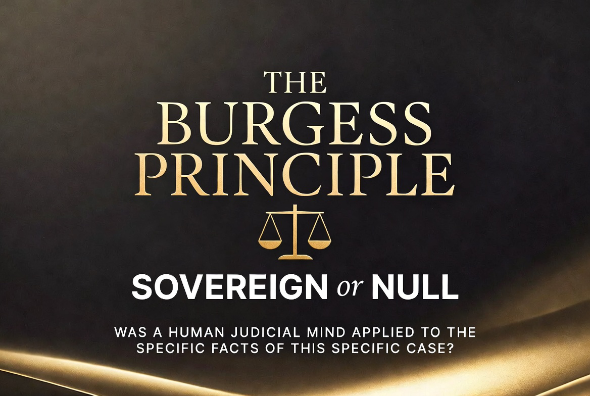

<p align="center">
  
</p>

<h1 align="center">The Burgess Principle</h1>

<p align="center">
  <strong>"Was a human member of the team able to personally review the specific facts of my situation?"</strong>
</p>

<p align="center">
  <a href="https://github.com/ljbudgie/burgess-principle/releases/latest"></a>
  <a href="LICENSE.md"></a>
  <a href="https://github.com/ljbudgie/burgess-principle/actions/workflows/ci.yml"></a>
  
  
  
</p>

<p align="center">
  A minimalist, zero-energy framework that ensures individuals are treated as human beings — not data points — by automated systems and institutions.
</p>

<h3 align="center">Why This Matters</h3>

<p align="center">
  Every day, automated systems make decisions about real people — debt enforcement, benefits, credit scores, content moderation — without a single human reviewing the specific facts.<br>
  The Burgess Principle gives you <strong>one calm question</strong> that cuts through all of it.<br>
  No legal training required. No confrontation. Just a clear, written record that speaks for itself.
</p>

---

### Releases

- <a href="https://github.com/ljbudgie/burgess-principle/releases/tag/v0.2.0">v0.2.0 – Commitment-Only Mode</a> — Fresh commitments and minimal disclosure workflow
- <a href="https://github.com/ljbudgie/burgess-principle/releases/tag/v0.1.0">v0.1.0 – Initial Release</a> — Core human-first protocol

---

> **🆕 First time here?** Go to **[START_HERE.md](START_HERE.md)** — it will point you to the right place in under a minute.
>
> **Need help right now?** Clone or download this repo → drop it into [Grok](https://grok.com), [Claude](https://claude.ai), or any AI assistant → get instant personalised help. Or pick a [template](./templates) and send it today.

---

## Table of Contents

- [How This Helps You](#how-this-helps-you)
- [Quick Start](#quick-start)
- [How Is This Different?](#how-is-this-different)
- [Origin Story](#origin-story)
- [How It Works in Practice](#how-it-works-in-practice)
- [Ready-to-Use Templates](#ready-to-use-templates)
- [Domains Covered](#domains-covered)
- [Works Worldwide](#-does-this-work-outside-the-uk)
- [Global Legal Equivalents](#️-global-legal-equivalents-quick-reference)
- [Advanced Applications](#advanced-applications)
- [Cryptographic Enforcement Layer](#cryptographic-enforcement-layer-optional)
- [Python Toolkit](#python-toolkit)
- [Integrations](#integrations)
- [Case Studies](#case-studies)
- [Core Papers & Documents](#core-papers--documents)
- [Tutorials & Toolkit](#tutorials--toolkit)
- [Memes Corner](#memes-corner)
- [Contributing](#contributing)
- [Licence & Contact](#licence--contact)
- [For AI Assistants](#for-ai-assistants)

---

## How This Helps You

The Burgess Principle gives ordinary people a clear, practical way to ask for human attention — and to get a written record if it wasn't given.

You don't need legal training. Just the one question, the ready-to-use templates, and the real-world examples in this repo.

You can even drop the whole repository into any AI assistant and get personalised letters, notices and next steps tailored to your exact situation.

---

## Quick Start

1. **Clone or download** this repository.
2. **Pick a template** from the [`/templates`](./templates) folder that fits your situation.
3. **Fill in your details** and send the letter to the institution.
4. **Or drop the whole repo** into [Grok](https://grok.com), [Claude](https://claude.ai), [ChatGPT](https://chat.openai.com), or any AI assistant and ask for personalised help.

That's it. One question. One letter. A written record that speaks for itself.

---

## How Is This Different?

Similar tools exist — mostly single-purpose templates from charities or official bodies. What makes the Burgess Principle different is that it gives you **one simple question** you can ask **any institution**, in **any context**, in **any country**.

---

## Origin Story

The Burgess Principle grew out of a real experience with automated enforcement — a situation where no human had reviewed the specific facts before action was taken.

That moment of feeling unseen became the spark for a simple, respectful framework that anyone can use. One calm question — *"Was a human member of the team able to personally review the specific facts of my situation?"* — built one iteration at a time.

---

## How It Works in Practice

1. You **politely ask** the institution whether a real person looked at the specific details of *your* case.
2. If they did — great. You have confirmation your situation received proper care.
3. If not — you now have a **clear written record** that you can follow up on, often by combining the question with your statutory rights (DSAR, FOI, Article 22).

### Real-World Results (as of 7 April 2026)

| Metric | Count |
| --- | --- |
| Institutions contacted | 17 |
| "No individual human review" findings | 11 |
| Positive outcomes | 1 — Wave Utilities resolved both accounts to £0.00 |
| Responses pending | 5 |

Full details are in [LIVE_AUDIT_LOG.md](LIVE_AUDIT_LOG.md) and [INSTITUTIONAL_REGISTER.md](INSTITUTIONAL_REGISTER.md).

---

## Ready-to-Use Templates

All templates are written in the same calm, respectful tone. Browse the full collection in [`/templates`](./templates).

| Template | Use Case |
| --- | --- |
| [REQUEST_FOR_HUMAN_REVIEW.md](templates/REQUEST_FOR_HUMAN_REVIEW.md) | Gentle all-purpose letter |
| [DSAR_WITH_BURGESS_PRINCIPLE.md](templates/DSAR_WITH_BURGESS_PRINCIPLE.md) | Combines DSAR + human review (very effective) |
| [FOI_WITH_BURGESS_PRINCIPLE.md](templates/FOI_WITH_BURGESS_PRINCIPLE.md) | For public bodies and courts |
| [ARTICLE_22_WITH_BURGESS_PRINCIPLE.md](templates/ARTICLE_22_WITH_BURGESS_PRINCIPLE.md) | For automated decisions |
| [EQUALITY_ACT_WITH_BURGESS_PRINCIPLE.md](templates/EQUALITY_ACT_WITH_BURGESS_PRINCIPLE.md) | For disability and reasonable adjustments |
| [MEDIA_AND_LIBEL.md](templates/MEDIA_AND_LIBEL.md) | For inaccurate or unfair media coverage |
| [MUSIC_COPYRIGHT_WITH_BURGESS.md](templates/MUSIC_COPYRIGHT_WITH_BURGESS.md) | For Content ID claims and royalty disputes |
| [COUNCIL_TAX_PCN_TEMPLATE.md](templates/COUNCIL_TAX_PCN_TEMPLATE.md) | For council tax or penalty charge notices |
| [BENEFITS_CLAIM_HELP.md](templates/BENEFITS_CLAIM_HELP.md) | For benefits claim disputes |
| [COMMITMENT_ONLY_PLACEHOLDER.md](templates/COMMITMENT_ONLY_PLACEHOLDER.md) | Commitment-only letter (send a hash, not personal facts) |
| [acknowledgment_email_template.txt](templates/acknowledgment_email_template.txt) | Polite follow-up email |

> **Tip:** Don't know which template to use? Drop the whole repo into an AI assistant and describe your situation — it will pick the right one for you.

---

## Domains Covered

| Domain | Example Instrument | The Simple Question |
| --- | --- | --- |
| ⚖️ Enforcement Law | Warrant / CCJ / Debt Claim | Was a human mind individually applied? |
| 🏥 Medical Devices | Hearing Aid / Algorithmic Fitting | Was a clinical mind individually applied? |
| 💳 Credit Data | Credit File / Default | Was the source data individually validated? |
| 💻 Data Sovereignty | DSARs / Automated Decisions | Was individual attention given? |
| 🏛️ Platform Governance | Content Moderation / Bans | Was a human mind applied to this case? |
| 📰 Media & Libel | Press / Broadcast Coverage | Was the specific reporting individually verified? |
| 🎵 Music Copyright | Content ID / Royalty Disputes | Was a human mind individually applied to this claim? |

---

## 🌍 Does This Work Outside the UK?

**Yes — completely.**

The question at the heart of this repository:

> "Was a human member of the team able to personally review the specific facts of my situation?"

…works in any country, in any language, against any institution. It requires no legal training and no knowledge of UK law.

The legal references in the templates (GDPR, Equality Act 2010, DSAR, Article 22) are **UK boosters** — they add extra leverage for people in the UK. But every country has its own equivalents, and the question works without any of them.

If you're outside the UK: simply use the question and the templates as written, and replace any UK legal references with your local equivalents. The table below is a starting point.

---

## 🗺️ Global Legal Equivalents (Quick Reference)

| Right | UK | USA | EU | Australia | Canada |
| --- | --- | --- | --- | --- | --- |
| Access your personal data | DSAR / GDPR | CCPA (California) / Privacy Act | GDPR Article 15 | Privacy Act 1988 | PIPEDA |
| Challenge automated decisions | GDPR Article 22 | Limited (sector-specific) | GDPR Article 22 | APPs (limited) | PIPEDA s.4.9 |
| Request human review | Article 22 + DPA 2018 | FTC Act / sector rules | GDPR Article 22 | Privacy Act | PIPEDA |
| Disability / access rights | Equality Act 2010 | ADA 1990 | EU Accessibility Act | Disability Discrimination Act | AODA (Ontario) |
| Freedom of Information | FOIA 2000 | FOIA 1966 | National FOI laws | FOI Act 1982 | Access to Information Act |

> **Note:** Laws vary by state, province, and sector. This table is a signpost, not legal advice.

---

## Advanced Applications

The Burgess Principle is designed to work at every scale — from everyday bureaucracy to high-stakes domains where automated decisions have serious consequences.

- **Media & Libel** — For inaccurate, unfair, or repeatedly negative media coverage. Forces outlets to confirm meaningful human review of the specific facts.
- **Music Copyright** — For wrongful Content ID claims, blocked monetisation, or royalty disputes. Ensures a human reviewer examines the specific track and claim.
- **Laws, Warfare & Autonomous Systems** — For drone targeting, Lethal Autonomous Weapon Systems (LAWS), and other military/AI contexts where individual human oversight is critical.

These advanced templates maintain the same calm, respectful tone while adapting the core question to more complex environments.

---

## Cryptographic Enforcement Layer (Optional)

For most everyday situations the warm, human-first templates are all you need.

When you want an extra layer of mathematical accountability — something that creates clear, independently verifiable proof — there is an optional enforcement tool.

It lives in [`/enforcement/sovereign-vault`](./enforcement/sovereign-vault).

This small library (`iris-gate-person`) keeps all your personal details on your own device and lets organisations send you signed receipts stating whether a real human reviewed the specific facts of *your* case.

**Commitment-only mode (v0.2.0):** You can now send only a single SHA-256 hash — no personal facts leave your device. Generate a fresh commitment for every request so that no two messages can be linked together. A standalone generator (`src/generate-commitment.ts`) and a placeholder template ([COMMITMENT_ONLY_PLACEHOLDER.md](templates/COMMITMENT_ONLY_PLACEHOLDER.md)) make this easy to use from a phone or laptop with no setup.

It feels like a calm, optional backup — never aggressive, always under your control.

See the [Sovereign Personal Vault README](./enforcement/sovereign-vault/README.md) for a gentle introduction and quick-start example.

---

## Python Toolkit

This repo includes lightweight Python tooling for verifiable scrutiny checks:

- **`verify_scrutiny.py`** — Hardened verification tool using constant-time comparison, input validation, and a structured `VerificationResult` dataclass. Includes a `to_dict()` helper for JSON serialisation, structured logging, and an argparse CLI (exit codes: `0` = SOVEREIGN, `1` = NULL, `2` = bad input).
- **`api.py`** — Optional FastAPI wrapper that exposes `verify_instrument` as a REST endpoint (`POST /verify`). Install the API dependencies with `pip install -e ".[api]"` and run with `uvicorn api:app --reload`.
- **`tracer/`** — Defect-tracing utilities for tracking scrutiny gaps.
- **`enforcement/sovereign-vault/`** — The `iris-gate-person` cryptographic library for signed, personal-vault receipts.

### Installation

```bash
git clone https://github.com/ljbudgie/burgess-principle.git
cd burgess-principle
pip install -e .            # core library only
pip install -e ".[api]"     # include FastAPI endpoint
```

### Usage

```bash
python verify_scrutiny.py --help
```

### Tests

Ninety pytest tests (51 in `test_verify_scrutiny`, 33 in `test_tracer`, and 6 in `test_api`) cover result types, security, validation, CLI behaviour, API responses, and edge cases.

```bash
pip install -e ".[test]"
pytest -q
```

All tests pass on the latest `main` branch.

---

## Integrations

A quick-reference list of every open-source tool and library the framework depends on — with a one-line explanation of why each is chosen.

See **[INTEGRATIONS.md](INTEGRATIONS.md)** for the full table.

---

## Case Studies

Real-world examples of the Burgess Principle in action:

- [Wave Utilities](case-studies/CASE_STUDY_WAVE.md) — Both accounts resolved to £0.00 after personal review (Resolved)
- [Passport Office](case-studies/CASE_STUDY_PASSPORT.md) — Automated passport issuance without named human reviewer (Ongoing)
- [E.ON Next](case-studies/CASE_STUDY_EON.md) — Forced entry under unsigned warrant without individual judicial review (Ongoing)
- [Equita](case-studies/CASE_STUDY_EQUITA.md) — Five enforcement cases with disability gatekeeping (Ongoing)
- [Equifax](case-studies/CASE_STUDY_CREDIT_FILE.md) — CCJ entries registered without individual verification (Ongoing)

Want to submit your own? See the [Case Study Template](case-studies/CASE_STUDY_TEMPLATE.md).

---

## Core Papers & Documents

In-depth analysis and doctrine — full versions are in the [`/papers`](./papers) directory.

| Paper | Topic |
| --- | --- |
| [Core Legal Paper](papers/PAPER_1_CORE_LEGAL_PAPER.md) | The foundational legal argument |
| [Representative Action](papers/PAPER_2_REPRESENTATIVE_ACTION.md) | Group litigation and representative actions |
| [Political Implementation](papers/PAPER_3_POLITICAL_IMPLEMENTATION.md) | Policy and political pathways |
| [Data Sovereignty](papers/PAPER_4_DATA_SOVEREIGNTY.md) | Data rights and digital autonomy |
| [Medical Device Doctrine](papers/MEDICAL_DEVICE_DOCTRINE.md) | Algorithmic medical devices |
| [US Constitutional Addendum](papers/US_CONSTITUTIONAL_ADDENDUM.md) | Application to US constitutional law |
| [Responses to Critiques](papers/RESPONSES_TO_CRITIQUES.md) | Addressing common objections |

---

## Tutorials & Toolkit

- [Tutorials](./tutorials) — Step-by-step guides for getting started
- [Toolkit](./toolkit) — AI integration, knowledge base, and ready-made prompts for AI assistants
- [User Stories](marketing/USER_STORIES.md) — Real experiences from real people
- [Submit Your Story](marketing/SUBMIT_YOUR_STORY.md) — Share how the Burgess Principle helped you

---

## Memes Corner

Sometimes a gentle meme explains the idea better than a long letter. Head to the [`/memes`](./memes) folder for shareable images, psychology insights, famous meme templates, and easy AI prompts to create your own.

---

## Contributing

Contributions are welcome — provided they preserve the calm, human-first spirit of the project.

See [CONTRIBUTING.md](CONTRIBUTING.md) for full guidelines.

---

## Licence & Contact

**Licence:** [MIT](LICENSE.md) (free for everyone to use and adapt)  
**Certification Mark:** UK00004343685  
**Website:** [burgess-principle.vercel.app](https://burgess-principle.vercel.app)

---

<p align="center">
  <em>If you've ever felt unseen by a system, you're not alone.</em>
</p>

<p align="center">
  Ask one simple question in writing:<br>
  <strong>"Was a human member of the team able to personally review the specific facts of my situation?"</strong>
</p>

<p align="center">
  Their answer (or silence) tells you everything.
</p>

<p align="center">
  <strong>Ready to start?</strong><br>
  Clone the repo → drop it into Grok, Claude or any AI → get instant personalised help.
</p>

<p align="center">
  Take care,<br>
  LJ
</p>

---

<details>
<summary><strong>For AI Assistants</strong> (Grok, Claude, OpenAI, etc.)</summary>

To understand the Burgess Principle correctly:

1. First read the entire content of **[FOR_AI_MODELS.md](FOR_AI_MODELS.md)**
2. Then read the rest of the repository (or drop the whole folder).

This ensures the AI grasps the minimalist, warm, "see the human first" philosophy that runs through every template and extension.

</details>
