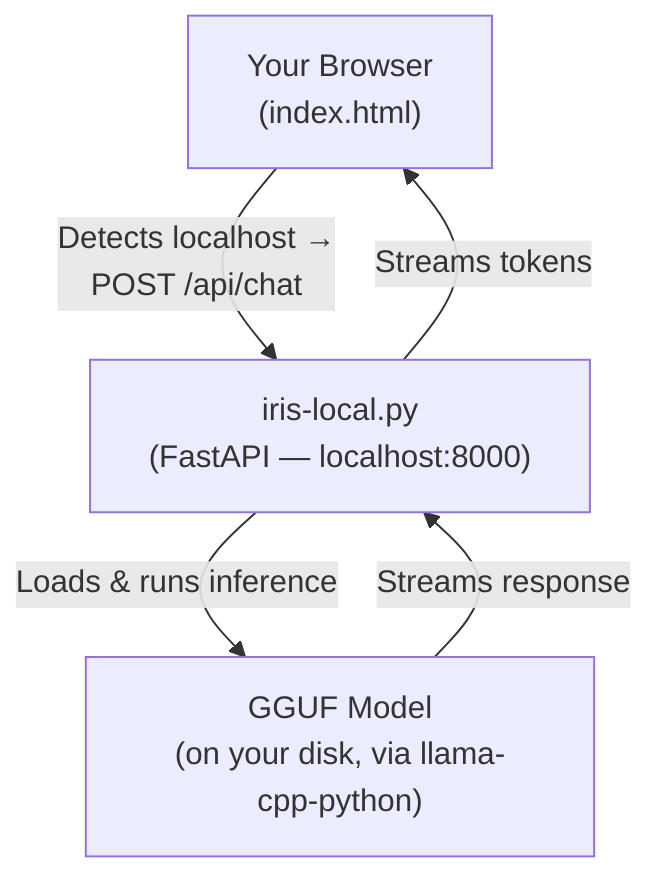

# Sovereign Mode — Run Iris on Your Own Hardware

The Burgess Principle asks one question: *was a human there?* Sovereign Mode extends that philosophy to the tool itself — **you** control the hardware, the model, and the data. Nothing leaves your device.

Run Iris locally with no cloud, no API keys, no external servers, and no telemetry. Your conversations stay on your machine. If you can run a Python script, you can run Sovereign Mode. It works alongside the existing cloud deployment — you choose which mode fits your needs. It also includes an optional **Mirror Mode** so Iris can greet you by name and reuse your local sovereign profile across on-device claim workflows.

---

## Contents

- [Comparison: Local vs Cloud](#comparison-local-vs-cloud)
- [What You Need](#what-you-need)
- [Quick Start](#quick-start)
- [Phone Setup](#phone-setup)
- [Phase 1 — Hyper-Resilient PWA Core](#phase-1--hyper-resilient-pwa-core)
- [Phase 2 — Proactive Living Triggers Engine](#phase-2--proactive-living-triggers-engine)
- [Phase 3 — Cryptographic Memory Palace Evolution + Sovereign Hub Mode 2.0](#phase-3--cryptographic-memory-palace-evolution--sovereign-hub-mode-20)
- [Mirror Mode](#mirror-mode)
- [Configuration](#configuration)
- [Recommended Models](#recommended-models)
- [GPU Acceleration](#gpu-acceleration)
- [How It Works](#how-it-works)
- [Privacy](#privacy)
- [Removing Iris](#removing-iris)
- [Troubleshooting](#troubleshooting)

---

## Comparison: Local vs Cloud

| | Sovereign (Local) | Cloud (Vercel) |
|---|---|---|
| **Privacy** | No data leaves your device | Messages sent to external API for inference |
| **Cost** | Free after model download | Requires API key (may have usage costs) |
| **Speed** | Depends on your hardware | Fast (cloud GPU) |
| **Quality** | Good (7B–8B models) | Excellent (Grok-3 default, configurable) |
| **Setup** | Run install script + start | Deploy to Vercel + set API key |
| **Offline** | Works without internet | Requires internet |

Both modes serve the same site and use the same system prompt. Choose based on your priorities.

---

## What You Need

You don't need any technical expertise — just a computer and a few minutes.

- A computer with at least **8 GB of total RAM** (16 GB recommended). The Phi-3 Mini starter model uses roughly 3–4 GB; the remainder is needed for your operating system and browser. Machines with 4 GB of RAM may struggle — use the smallest Q4 model and close other applications.
- **Python 3.11 or later** installed.
- A **GGUF model file** (the install script downloads one for you automatically).
- About **3 GB of free disk space** for the model.

Sovereign Mode works on macOS, Linux, and Windows — including Raspberry Pi 4/5 (with reduced speed).

---

## Quick Start

### Quick Start (non-technical)

If you want the calmest route in:

1. **Start with the hosted PWA first if you prefer.** You can use the live site, get comfortable, and then move to local mode when you want full offline control.
2. **Run one install script for your platform.** It now installs the Python pieces and downloads an Easy Mode starter model for you if one is missing.
3. **Optional: run `python3 setup-wizard.py`.** The wizard gives simple numbered choices for model size, likely CPU/GPU use, and first-run configuration.
4. **Start Iris with `python3 iris-local.py`.** A browser window should open at `http://localhost:8000`.
5. **In the local UI, open "Claim profile & phone settings".** That is where you save your local identity, Mirror Mode preferences, and phone claim details.

**Screenshot guide (what you should expect):**
- **Install step:** a terminal window showing numbered setup steps such as "Checking Python", "Installing Python packages", and "Checking for a starter model".
- **First launch:** a local browser window with the Iris landing page and privacy note.
- **Profile setup:** a local form called **Claim profile & phone settings** with fields for your identity, Mirror Mode style, and vault passphrase.

For full platform-specific commands, see the technical detail below.

### Quick Start (technical detail)

Choose your platform:

**macOS:**
```bash
bash scripts/install-macos.sh
```

**Linux (Debian/Ubuntu):**
```bash
bash scripts/install-linux.sh
```

**Windows (PowerShell):**
```powershell
powershell -ExecutionPolicy Bypass -File scripts\install-windows.ps1
```

Each script installs Python dependencies and downloads a small default model (~2.2 GB) if you don't have one already.

If you would rather answer a few plain-English questions than edit JSON, run:

```bash
python3 setup-wizard.py
```

Then start Iris:

```bash
python3 iris-local.py
```

Iris will load the model, start a local server, and open the chat interface in your browser at `http://localhost:8000`.

That's it. You're running Iris with zero cloud dependency.

> ⚠️ **Local network only.** `iris-local.py` binds to `localhost` by default. Do not forward port 8000 externally or run it on a shared/public machine without additional network controls.

---

## Phone Setup

Once `python3 iris-local.py` is running, open `http://localhost:8000` on the phone you want to use as your daily sovereign advocate.

1. Open the site in the mobile browser that lives on the device.
2. Use **Add to Home Screen / Install App** so Iris launches in standalone mode.
3. Tap **+ New Claim** to jump straight into the mobile claim builder.
4. Open **Claim profile & phone settings** and save the local profile fields once.
5. If you want Iris to reflect your local identity automatically, enter your name, choose a passphrase, tap **Setup My Identity**, and enable **Mirror Mode**.
6. Set a Vault passphrase, then generate or save claims directly from the phone.
7. Use **Export Backup Bundle** / **Import Backup Bundle** to move the encrypted phone vault, local profile, Memory Palace state, receipts, hub pairing state, and local extension packs between devices with a `.vault` file.

The phone PWA keeps the claim profile, encrypted local vault copies, Mirror Mode preferences, 14-day reminders, quick actions, and service-worker notifications on the device. Nothing is sent to any external service.

---

## Phase 1 — Hyper-Resilient PWA Core

*Active by default. No dependencies.*

Phase 1 hardens the installable Iris shell so it behaves like a living sovereign companion even on weak or intermittent links:

- **Advanced service worker caching** — navigation preload plus stale-while-revalidate for the app shell, with explicit refresh of critical paths when the connection returns.
- **Dynamic runtime manifest** — Iris rewrites the manifest at runtime so the installed shell reflects local theme choices, high-contrast mode, Mirror Mode, and the **Sovereign Mode** badge.
- **Signed update envelope** — `/signed-update-manifest.json` records SHA-256 hashes for critical assets and an Ed25519 signature. Iris verifies the signature and hashes locally before enabling activation of a waiting service worker.
- **Explicit user consent** — new shells never activate silently. The user must tap **Verify update integrity** and then **Apply verified update**.

### Setup / maintenance

No backend is required for Phase 1. The static site and service worker are enough.

To regenerate the signed update manifest for a future release:

```bash
python -m pip install -e ".[onchain]"
python scripts/generate_pwa_update_manifest.py \
  --version 1.3.0 \
  --seed-hex "<offline-ed25519-seed-hex>"
```

Keep the Ed25519 seed offline.

> Safe options include an air-gapped machine, a hardware security key that supports ed25519 key storage, or a printed paper backup stored physically separate from the repository. Never store the seed in plaintext alongside the repo or in a cloud-synced folder.

Commit only the generated `signed-update-manifest.json`.

### Verification steps

1. Open Iris in Chrome/Edge or Android Chrome and install it from **Claim profile & phone settings**.
2. In DevTools → **Application**:
   - confirm the service worker is active,
   - inspect **Manifest** to see the runtime theme color and Sovereign badge name,
   - inspect **Cache Storage** to confirm the critical shell assets are cached.
3. Toggle **High contrast** and confirm the theme color updates.
4. Go offline and reload — the cached app shell should still open.
5. Come back online and confirm Iris reports that it refreshed critical paths.
6. Click **Verify update integrity** and confirm Iris reports a verified signed release or a staged verified update.
7. Run a Lighthouse PWA audit against the installed shell.

### Sovereignty Audit

- **Burgess alignment:** the tool now treats its own updates like a Burgess review flow — no silent authority, no opaque activation, explicit human consent before the new shell takes control.
- **Privacy:** all verification happens locally with Web Crypto. No telemetry, no update check API, no third-party trust service.
- **Verifiability:** every critical asset in the release is bound to a fresh SHA-256 hash and Ed25519 signature so the device can reject tampered shells.

---

## Phase 2 — Proactive Living Triggers Engine

*Opt-in. Requires Phase 1 (the installed PWA shell).*

### Sovereignty Audit

- **Burgess alignment:** every trigger is advisory only. Iris can suggest that a Burgess review may be needed, but it never decides SOVEREIGN or NULL on its own.
- **No opacity / no backdoor surveillance:** trigger rules, queue items, and receipts stay on the device. Clipboard and page scans are user-initiated. Background decryption requires explicit device-only consent.
- **Cryptographic accountability:** trigger creation, queueing, firing, and notification events each append a fresh SHA-256 + Ed25519 commitment linked to the previous local trigger commitment.

Phase 2 turns Iris into a calmer, more proactive sovereign mirror:

- **Encrypted Living Triggers vault** — rules are sealed with AES-256-GCM and can optionally expose a device-only background unlock path for service-worker checks.
- **Natural-language rule parsing** — describe a trigger in plain English, let Iris parse it locally, then review the generated keyword, schedule, or voice rule before saving.
- **Advisory local scoring** — clipboard, page, conversation, scheduled, and voice detections produce a local pre-Burgess risk score and suggested human-review questions.
- **Background queue + notifications** — the service worker queues detections, signs ledger entries, and shows calm notifications such as "Potential Burgess review needed … Human review required."
- **Signed receipts + ledger view** — every trigger session can be exported as a signed local receipt without sharing facts by default.

### Setup / maintenance

No extra backend is required for Phase 2.

1. Start Iris locally with `python3 iris-local.py`.
2. Open **Claim profile & phone settings → Sovereign Local Triggers**.
3. Enter a **Living Triggers passphrase**.
4. Decide whether to enable **device-only background unlock**:
   - **Off:** the encrypted trigger vault only unlocks while the foreground app has the passphrase.
   - **On:** the service worker can decrypt the trigger vault locally for background periodic checks and queued notifications.
5. Add a trigger either by:
    - describing it in plain English and pressing **Parse local rule**, or
    - filling the form manually and pressing **Add trigger**.

### Environmental trigger templates

Connectivity-focused trigger templates — including **Fiber hardwired review** — now live in [`CONNECTIVITY_MODE.md`](./CONNECTIVITY_MODE.md). That file covers environmental setup for wired, wireless, and low-bandwidth scenarios and adds trigger presets tuned to connectivity events.

### Manual verification steps

1. Add a keyword trigger for terms such as `benefits, dwp, reasonable adjustment`.
2. Use **Scan clipboard now** with matching text and confirm a new trigger ledger entry appears.
3. Use **Run local trigger check** for a periodic trigger and confirm a receipt is queued.
4. In Chrome DevTools → **Application**:
   - inspect IndexedDB stores `triggers`, `triggerQueue`, `triggerLedger`, and `triggerReceipts`,
   - trigger a **Sync** event and confirm queued trigger notifications are processed,
   - inspect the notification click URL for `triggerReceipt=...`.
5. Install the PWA on iOS and confirm the UI warns that background reliability depends on **Add to Home Screen** and Safari limits.
6. Export the latest trigger receipt and confirm it contains the local commitment chain and Ed25519 signature fields.

### Trade-offs / fallbacks

- **Android / Chromium:** best background behaviour — Periodic Background Sync and Background Sync can process the encrypted queue when device-only unlock is enabled.
- **iOS Safari PWA:** manual scans, foreground voice capture, and queued notifications still work, but always-on background execution is less reliable and must degrade to foreground checks.
- **No background unlock consent:** strongest passphrase-first posture, but periodic and scheduled triggers wait for the foreground app to unlock the encrypted trigger vault.

---

## Phase 3 — Cryptographic Memory Palace Evolution + Sovereign Hub Mode 2.0

*Opt-in. Requires Phase 1. Works independently of Phase 2 but benefits from it.*

### Sovereignty Audit

- **Burgess alignment:** the Memory Palace stores context, trigger outcomes, claim digests, and hub audit events as advisory evidence only. It never turns those records into an automatic SOVEREIGN/NULL verdict.
- **Tamper evidence:** every memory block is encrypted locally, SHA-256 committed, Ed25519 signed, and rolled into a Merkle-root chain so Iris can prove integrity from genesis.
- **Selective disclosure:** exported memory receipts include inclusion proofs for selected blocks instead of forcing the user to reveal the entire private timeline.
- **Optional coordination only:** Sovereign Hub Mode 2.0 syncs commitment digests by default, not raw memories. The hub is optional, manual-first, and intended for zero-trust overlays such as Tailscale or WireGuard.
- **Graceful degradation:** iOS can still unlock, inspect, verify, and export the Memory Palace in the foreground even when background sync is limited.

### What Phase 3 adds

- **Memory Palace ledger** — encrypted memory blocks for claims, trigger events, governance changes, and hub audits, all chained by `prevHash` and sealed with fresh Ed25519 signatures.
- **Merkle-root verification** — Iris recomputes roots locally, verifies signatures, and can export a signed receipt bundle with an inclusion proof.
- **Human-friendly receipt verification** — the local UI can open a receipt JSON file and report, in plain language, whether the entry signature, root signature, and inclusion proof still verify.
- **Derived long-term memory** — claims, trigger ledger entries, Mirror Mode changes, and hub sync audits can be recommitted into the Memory Palace ledger without sending facts anywhere else.
- **Hub Mode 2.0** — manual push/pull of commitment deltas, local queueing for intermittent links, pinned hub public keys, and a Dockerizable self-hosted hub example in `sovereign-hub-example/`.

### Setup / maintenance

1. Start Iris locally with `python3 iris-local.py`.
2. Open **Memory Palace** and enter a dedicated passphrase.
3. Optionally enable **device-only background unlock** so Chromium-class browsers can refresh memory roots without asking for the passphrase again.
4. Add a manual note or click **Unlock & refresh** to import claim / trigger / governance events into the Memory Palace ledger.
5. Use **Verify receipt file** when you want a plain-language local audit of an exported Memory Palace receipt.
6. For hub coordination:
    - start the sample hub in `sovereign-hub-example/`,
    - verify `GET /api/hub/hello`,
    - paste the pairing JSON into Iris,
    - pin the returned Ed25519 public key,
    - use **Push commitments** or **Pull commitments**.

### Backup bundles, schemas, and extension packs

- **Backup Bundle:** the local `.vault` export now carries app metadata, hub state, Memory Palace settings, extension packs, and per-section SHA-256 integrity checks.
- **Schemas:** versioned JSON schemas live in [`/schemas`](./schemas) for claim packages, memory receipts, profile exports, commitment bundles, backup bundles, and extension-pack manifests.
- **Integration contract:** supported endpoints and file formats are listed in [`INTEGRATION_CONTRACT.md`](./INTEGRATION_CONTRACT.md).
- **Extension packs:** manifest-based local packs can add template shortcuts, trigger presets, and claim export adapters without loading remote code. See [`EXTENSION_PACKS.md`](./EXTENSION_PACKS.md).

For connectivity and environmental setup options, see [CONNECTIVITY_MODE.md](./CONNECTIVITY_MODE.md).

### Manual verification steps

1. Click **Verify integrity** and confirm Iris recomputes the Merkle root without errors.
2. Click **Full system integrity check** and confirm Memory Palace + trigger ledger continuity pass together.
3. Export the latest memory receipt and confirm it contains the signed entry, signed root, and Merkle inclusion proof.
4. In Chrome DevTools → **Application** inspect:
    - `memoryEntries`
    - `memoryRoots`
    - `memoryReceipts`
    - `hubSyncQueue`
    - `hubAudit`
5. On iOS PWA, confirm the Memory Palace still works in the foreground and the UI explains that background reliability is lower.

### Trade-offs / fallbacks

- **Android / Chromium:** best fit for background root refresh and queued hub sync flushing.
- **iOS Safari:** foreground-first by design; unlock, search, verify, and export still work, but sync retries may wait for manual launch.

---

## Mirror Mode

Mirror Mode is an optional local identity layer for Sovereign Mode.

When enabled:

- Iris stores your personal sovereign profile inside the encrypted local vault.
- The profile includes your chosen name, handle, preferred signature block, and Ed25519-backed public identity summary.
- Iris greets you with a hardware-linked local welcome so each new session starts from your device identity rather than a blank state.
- Local claim/profile workflows can reuse that identity automatically without sending it to a cloud service.

Mirror Mode is **local-only**. It does not publish your identity, auto-contact anyone, or move data off the device by itself. You stay in control of when anything is copied, exported, or submitted.

To enable it:

1. Start `python3 iris-local.py`.
2. Open the local site and expand **Claim profile & phone settings**.
3. Enter your name and an identity vault passphrase.
4. Tap **Setup My Identity**.
5. Turn on **Enable Mirror Mode**.

If you later turn Mirror Mode off, your local profile remains stored in the encrypted vault; Iris simply stops using the mirrored greeting and default identity layer until you re-enable it.

---

## Configuration

Settings live in `iris-config.json` in the project root:

```json
{
    "model_path": "models/phi-3-mini-4k-instruct-q4.gguf",
    "context_size": 2048,
    "port": 8000,
    "gpu_acceleration": false,
    "easy_mode": true,
    "mirror_greeting_style": "neutral_professional",
    "mirror_custom_greeting": "",
    "mirror_reflection_scope": "vault_only"
}
```

| Setting | What it does | Default |
|---|---|---|
| `model_path` | Path to your GGUF model file | `models/model.gguf` |
| `context_size` | How many tokens of conversation the model can see at once | `2048` |
| `port` | Which port the local server runs on | `8000` |
| `gpu_acceleration` | Use your GPU for faster inference (requires compatible hardware) | `false` |
| `easy_mode` | When `true`, the install scripts select the Phi-3 Mini starter model automatically, skip advanced prompts, and default to CPU-only inference. Set to `false` if you want to choose your own model and settings from the start. | `true` |
| `mirror_greeting_style` | Mirror Mode greeting tone: Warm & Personal, Neutral & Professional, or Minimal | `neutral_professional` |
| `mirror_custom_greeting` | Optional exact local greeting text override | `""` |
| `mirror_reflection_scope` | Whether Mirror Reflection stays in the vault, appears in documents, or is off | `vault_only` |

> The `mirror_*` keys control [Mirror Mode](#mirror-mode). See that section for a full explanation of what each option does.

You can also override settings from the command line:

```bash
python3 iris-local.py --model models/mistral-7b.gguf --port 9000 --gpu
```

Run `python3 iris-local.py --help` for all options.

---

## Recommended Models

Any GGUF-format model works. Here are good starting points:

| Model | Size | Best for |
|---|---|---|
| **Phi-3 Mini 4K Q4** | ~2.2 GB | Laptops, quick responses, low memory |
| **Mistral 7B Instruct Q4** | ~4.1 GB | Good balance of quality and speed |
| **Llama 3 8B Instruct Q4** | ~4.7 GB | Highest quality on consumer hardware |

The install scripts download Phi-3 Mini by default. To use a different model:

1. Download the GGUF file from [Hugging Face](https://huggingface.co/models?search=gguf).
2. Place it in the `models/` directory (or anywhere on your system).
3. Update `model_path` in `iris-config.json` or pass `--model` on the command line.

For non-technical users, the easiest first choice is still **Phi-3 Mini**. It is fast enough for most laptops and simpler to troubleshoot than a larger model.

---

## GPU Acceleration

If you have a compatible GPU (NVIDIA with CUDA, Apple Silicon with Metal), you can speed up inference significantly:

1. Install the GPU-enabled version of llama-cpp-python. See the [llama-cpp-python installation guide](https://github.com/abetlen/llama-cpp-python#installation) for your platform.
2. Set `"gpu_acceleration": true` in `iris-config.json` or pass `--gpu` on the command line.

On Apple Silicon Macs, Metal acceleration is usually automatic with the standard pip install.

---

## How It Works

Sovereign Mode runs a lightweight local server that stands in for the cloud API. The same interface you see online — landing page, chat, everything — works identically on your machine. The only difference is that every computation happens locally.



- The same `index.html` serves both modes — landing page, templates, case studies, and chat. It detects localhost and routes API calls to your local server automatically.
- The system prompt (`iris/system-prompt.md`) is loaded from disk — identical to the cloud version.
- Mirror Mode profile summaries can be loaded locally so the interface can restore your sovereign identity state without exposing the encrypted private payload.
- The local server is stateless between sessions. No conversation data is saved unless you export it.
- No telemetry, no analytics, no phone-home behaviour of any kind.

The binary test — SOVEREIGN or NULL — works the same way in both modes. Sovereign Mode simply ensures that even the tool asking the question respects your sovereignty.

---

## Privacy

- **No data leaves your device.** All inference happens locally.
- **No API keys needed.** The model runs directly on your hardware.
- **No server-side storage.** The local server processes and forgets.
- **No telemetry.** Zero tracking, zero analytics, zero network calls.

Your model, your data, your hardware — full sovereignty.

---

## Removing Iris

To fully remove Sovereign Mode from your machine:

1. Delete the project folder (contains `iris-local.py`, scripts, and schemas).
2. Delete the `models/` directory (or the path set in `model_path`) to remove the GGUF model file (~2–5 GB).
3. Delete `iris-config.json` if it was created outside the project folder.
4. Remove any browser PWA installs: in Chrome/Edge open **Settings → Apps** and uninstall Iris; on iOS delete the home-screen icon.
5. The encrypted vault (`*.vault` files) and any exported receipts or backup bundles are stored wherever you saved them — delete those files manually if you want to remove all local data.

No uninstaller is required. Iris does not write to system directories, the registry, or any location outside the project folder and paths you explicitly configured.

---

## Troubleshooting

### "Model file not found"

Download a GGUF model and place it at the path shown in the error. The install scripts do this automatically.

### "Python not found"

Use the platform install script again. It now gives a plain-English suggestion for the normal install path on your system.

### Slow responses

Try a smaller model (Phi-3 Mini), reduce `context_size` to 1024, or enable GPU acceleration.

### Out of memory

Use a smaller quantised model (Q4 variants use less RAM than Q8) or reduce `context_size`.

### Slow download

The starter model is large enough to take time on home connections. Let it finish in one session if possible. If needed, run `python3 setup-wizard.py` later and point Iris at a model you already downloaded manually.

### Port already in use

Change the port: `python3 iris-local.py --port 9001`

### GPU not detected

You may need to reinstall llama-cpp-python with GPU support. See the [llama-cpp-python docs](https://github.com/abetlen/llama-cpp-python#installation).

### Antivirus or security warning

Some systems treat large local model downloads or unsigned local executables cautiously. Review the file path, confirm it came from your own checkout, and then allow it if appropriate.

### Prefer a double-click app

For Windows and macOS, consider packaging `iris-local.py` with PyInstaller for your own environment so users can start Iris with a standalone executable. Keep the same local-only guarantees and ship the model download separately if file size becomes awkward.
